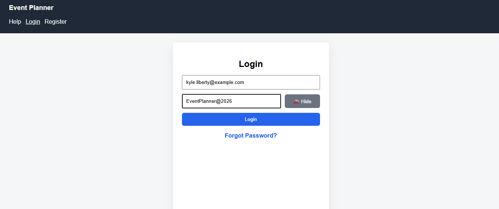
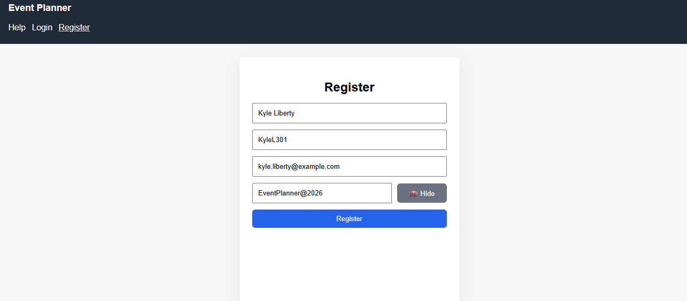
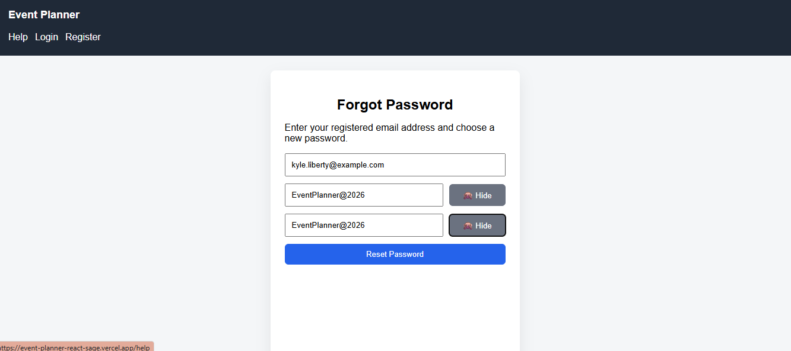
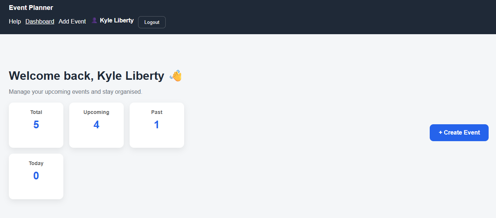
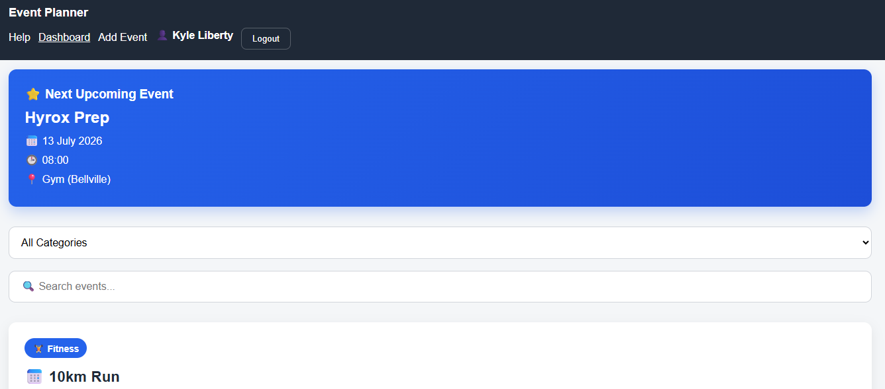
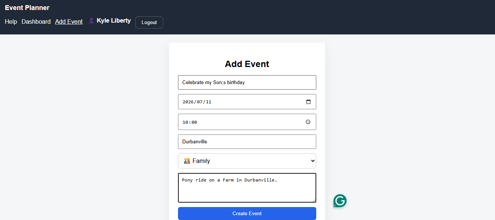
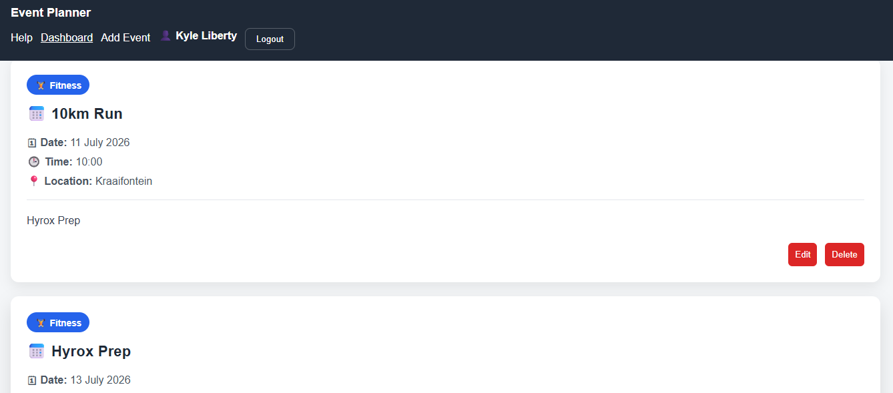

# 📅 React Event Planner

A modern event management web application built with **React**, **Vite**, and the **React Context API**.

The application allows users to securely register, log in, and manage their own personal events through a clean and responsive interface.

This project was originally developed as part of my software development learning journey and has since been continuously improved with additional features, UI enhancements, validation, and better software engineering practices to serve as a portfolio project.

---

## 🌐 Live Demo

https://event-planner-react-sage.vercel.app

---

## 📂 GitHub Repository

https://github.com/KyleL301/event-planner-react

---

# 🚀 Features

## 🔐 Authentication

- User registration
- Secure login and logout
- Protected routes
- Duplicate email validation
- Password strength validation
- Forgot password recovery
- Password visibility toggle
- Persistent login sessions using Local Storage
- User-specific dashboards

---

## 📅 Event Management

- Create new events
- Edit existing events
- Delete events
- Event ownership (users only see their own events)
- Event categories
- Event descriptions and locations
- Local data persistence using Local Storage

---

## 📊 Dashboard

- Personalized welcome message
- Dashboard statistics
- Upcoming event widget
- Event search functionality
- Chronological event sorting using date and time
- Responsive event cards
- Professional dashboard layout

---

## 🎨 User Experience

- Responsive navigation
- Clean interface
- Inline validation messages
- Professional styling using CSS
- Mobile-friendly layout
- Improved user feedback and usability

---

# 🛠️ Technologies Used

- React
- JavaScript (ES6+)
- React Router DOM
- React Context API
- Vite
- HTML5
- CSS3
- Local Storage
- Git
- GitHub
- Vercel

---

# 📂 Project Structure

```text
src/
│
├── components/
│   ├── Header.jsx
│   ├── EventCard.jsx
│   ├── ProtectedRoute.jsx
│   └── Layout.jsx
│
├── context/
│   ├── AuthContext.jsx
│   └── EventContext.jsx
│
├── pages/
│   ├── Dashboard.jsx
│   ├── Login.jsx
│   ├── Register.jsx
│   ├── ForgotPassword.jsx
│   ├── AddEvent.jsx
│   ├── EditEvent.jsx
│   └── Help.jsx
│
├── styles/
│   └── main.css
│
├── router.jsx
├── App.jsx
└── main.jsx
```

The application follows a component-based architecture where reusable UI components, global state management, and page-level components are separated to improve maintainability and scalability.

---

# 📸 Application Screenshots

## Login Page



---

## Register Page



---

## Forgot Password



---

## Dashboard Overview



---

## Upcoming Event Widget



---

## Add Event Page



---

## Event Cards



---

# ⚙️ Installation

## Clone the repository

```bash
git clone https://github.com/KyleL301/event-planner-react.git
```

## Navigate into the project

```bash
cd event-planner-react
```

## Install dependencies

```bash
npm install
```

## Run the development server

```bash
npm run dev
```

Open the local development URL displayed in the terminal.

Typically:

```text
http://localhost:5173
```

---

# 🧠 What I Learned

While developing this project I strengthened my understanding of:

- React component architecture
- State management using Context API
- React Router and protected routes
- Controlled forms
- CRUD operations
- JavaScript array methods (`map`, `filter`, `find`, `sort`)
- Client-side authentication
- Local Storage persistence
- Building reusable components
- Conditional rendering
- Form validation
- Git version control and feature-based commits
- Deployment using Vercel

---

# 🔮 Future Improvements

Potential future enhancements include:

- Backend API using Node.js and Express
- MongoDB database integration
- JWT authentication
- Email verification
- Push notifications
- Calendar integration
- Recurring events
- User profile management
- Email reminders
- Dark mode support

---

# 👨‍💻 Author

## Kyle Liberty

Aspiring Software Developer | React Developer | Full Stack Developer

### GitHub

https://github.com/KyleL301

### LinkedIn

https://www.linkedin.com/in/kyle-liberty-7747b0142

---

# ⭐ Project Status

✅ Portfolio Project Complete

This project continues to receive improvements as new technologies and software engineering practices are learned and adopted.
